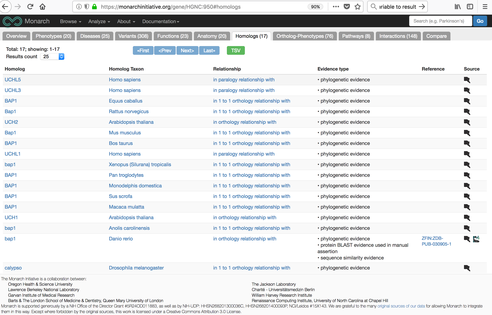

```{r setup, include=FALSE}
knitr::opts_chunk$set(echo = TRUE)
```

## Introduction.

This is the README for the monarchr package.

We use monarchr to retrieve and work with genetic, phenotype, and ontological 
information from the Monarch Inititiative [monarchinitiative.org](https://monarchinitiative.org).

Monarch Initiative's API provides structured data from many biological databases. 
Some of the key advantages of Monarch ensue from their considerable effort to enable 
cross species lookups and unification of many different, often species specific ontologies.

The monarchr package has the following goals:

1. Query Monarch's web API, returning R objects for further analysis in R.
2. Ease access from other popular bioconductor packages to Monarch's data.
3. Facilitate reuse of Monarch's data by other packages.

## Examples.

Here are a few examples of usage.

### Get homologs to a particular gene.

Often, we are interested in a particular gene's homologs or orthologs in another organisms.

We query Monarch by using the bioentity_homologs function.

```{r ex_homologs}
library(monarchr)
gene <- "NCBIGene:8314"
results <- bioentity_homologs(gene)
```

The results are a tibble of homologs (paralogs, orthologs and homologs).

When we ran this query, we retrieved ```r nrow(results$homologs)``` homologs.

```{r ex_homologs_resu, echo = TRUE}
head(data.frame(results$homologs), 5)
```

<!-- In this README we convert that to a Data Table so you can scrolll through them. -->

<!-- ```{r } -->
<!-- library(DT) -->
<!-- DT::datatable(results$homologs) -->
<!-- ``` -->

#### (Optional) Verify that this search returns the same list of homologs as found searching Monarch Inititive's website.

1. Go to Monarch's front page: [https://monarchinitiative.org/]
1. In the search box, enter and search for: NCBIGene:8314.
2. Select the exact match (of thousands) from Homo sapiens.
   (This is the first match and shows the gene name is BAP1.)
3. Select homologs from the tabs at the top of the next page.

You should see something similar to the following view.



## Troubleshooting.

If we encounter problems, such as an empty result, we can always ask for Monarch's 
response to our query.

### Response from Monarch Initiative.

Here is the response from Monarch Inititative's API as we captured it in monarchr.

```{r ex_homologs_resp, echo = TRUE}
results$response
```

The server responded with an OK (200) status, and appears to have some content associated with it.

### View JSON directly from the server.

We can use the URL at the top of monarchr's summary of the response to see the JSON results directly from the server.

(this is easier to view in Firefox):

[https://api.monarchinitiative.org/api/bioentity/gene/NCBIGene%3A8314/homologs/?rows=100&fetch_objects=true&format=json]

### View HTML on server.

If you prefer to see the expected results as HTML, note how the example of looking up NCBIGene:8314 
on Monarch Initiative website ended up at a table for Monarch's preferred ID (HGNC:950). 

[https://monarchinitiative.org/gene/HGNC:950#homologs]

Replacing HGNC:950 with NCBIGene ID, we are successfully directed to the same view.

[https://monarchinitiative.org/gene/NCBIGene:8314#homologs]
